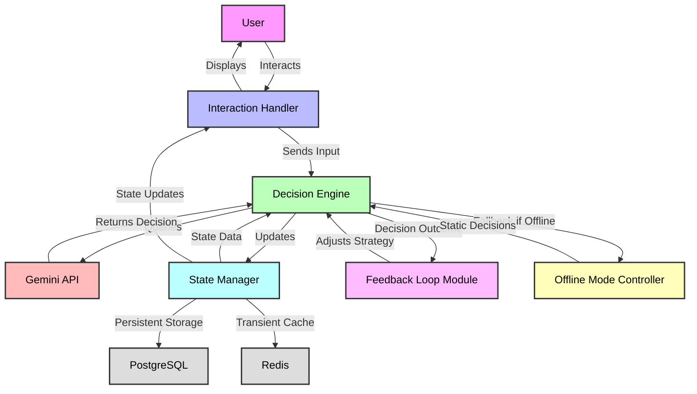

# Phase 1: AI Agent Architecture Design for Agentic AI Framework

## Overview
This document summarizes the work conducted on Days 9-10 of Phase 1 for the Agentic AI Demonstration Framework within "Restaurant Revenue Rocket." The focus is on designing the architecture for an AI agent capable of autonomous decision-making in restaurant management scenarios. This architecture specifies integration with the Google Gemini API for decision-making logic, handles real-time user interaction, and manages state transitions within gamified scenarios.

## Objectives
- Define a modular and scalable architecture for the AI agent to support autonomous decision-making.
- Specify integration points with the Gemini API to leverage AI capabilities for generating decisions.
- Design mechanisms for real-time user interaction, allowing users to observe, influence, or override AI decisions during demonstrations.
- Establish state management strategies to track scenario progress, decision history, and operational variables over time.

## Design Principles
The architecture design adheres to the Software Engineering (SWE) principles outlined in 'docs/phase1-research-design-progress.md', with a focus on:
- **Modularity**: Components are separable to facilitate testing, updates, and future extensions.
- **Transparency**: Decision-making processes are explainable to build user trust in demo environments.
- **Scalability**: The system supports multiple concurrent demo sessions with minimal performance degradation.
- **User-Centric Design**: Prioritizes user engagement by enabling interaction and feedback within gamified scenarios.
- **Risk Mitigation**: Incorporates fallback mechanisms to handle technical failures or data issues, as identified in 'docs/phase1-risks-challenges-mitigation.md'.

## AI Agent Architecture Overview
The AI agent architecture is composed of distinct components that interact to enable autonomous decision-making, user engagement, and state persistence. The high-level structure is designed to integrate seamlessly with the existing "Restaurant Revenue Rocket" tech stack (React frontend, Node.js backend, PostgreSQL, Redis, Docker).

### Core Components
1. **Decision Engine**
   - **Purpose**: Processes input data and generates decisions for restaurant management tasks (e.g., inventory ordering, dynamic pricing) using AI logic.
   - **Functionality**:
     - Receives scenario state data (e.g., current inventory, sales trends) and user inputs.
     - Formulates prompts for the Gemini API to request decision recommendations (e.g., "Given sales data X, recommend inventory order Y").
     - Parses API responses and applies decision rules or thresholds to finalize actions.
   - **Integration with Gemini API**: 
     - Sends structured prompts via API calls, leveraging parameters like max tokens (2048) and temperature (0.7) for controlled, relevant outputs.
     - Handles API latency or failures with cached responses or pre-defined fallback decisions for offline mode.
   - **Technology**: Node.js module for backend processing, interfacing with the Gemini API through HTTP requests.

2. **State Manager**
   - **Purpose**: Tracks and updates the operational state of restaurant scenarios over time, ensuring consistency across decisions and user interactions.
   - **Functionality**:
     - Maintains variables such as inventory levels, pricing structures, staff schedules, and customer satisfaction metrics.
     - Updates state based on AI decisions (e.g., reducing inventory after an order is placed) and user actions (e.g., overriding a price change).
     - Manages time progression in simulations, triggering daily or hourly updates to reflect operational changes.
   - **Technology**: Node.js for state logic, with Redis for transient, fast-access state caching and PostgreSQL for persistent storage of historical states.

3. **Interaction Handler**
   - **Purpose**: Facilitates real-time user interaction with the AI agent during demo scenarios, enhancing engagement and learning.
   - **Functionality**:
     - Displays AI decisions and rationales to users via the frontend (e.g., "Price increased due to high demand").
     - Captures user inputs, such as overrides, feedback, or scenario adjustments, and relays them to the Decision Engine and State Manager.
     - Provides notifications or alerts for critical decisions or state changes (e.g., low inventory warning).
   - **Technology**: React components for frontend visualization and interaction, communicating with backend via Express API endpoints.

4. **Feedback Loop Module**
   - **Purpose**: Evaluates decision outcomes and adjusts AI strategies to improve future performance, simulating learning behavior.
   - **Functionality**:
     - Analyzes decision impacts on key metrics (e.g., revenue, customer satisfaction) post-execution.
     - Adjusts decision weights or prompt structures for the Gemini API based on outcomes (e.g., prioritizing cost reduction if waste is high).
     - Logs evaluation data for long-term analysis and demo reporting.
   - **Technology**: Node.js for backend analysis, with data stored in PostgreSQL for historical tracking.

5. **Offline Mode Controller**
   - **Purpose**: Ensures demo functionality without internet or API access, maintaining a seamless user experience.
   - **Functionality**:
     - Switches to pre-defined decision paths or static responses when connectivity is lost or API key is unavailable.
     - Mimics online AI behavior as closely as possible using locally stored logic or JSON datasets.
   - **Technology**: Node.js for logic switching, with offline data stored in local JSON files under './frontend/public/assets/data/agentic-ai-offline/'.

### Architecture Diagram
Below is a conceptual flowchart of the AI agent architecture, illustrating data flow and component interactions:

**Diagram Explanation**:
- The user interacts with the system through the Interaction Handler, which relays inputs to the Decision Engine.
- The Decision Engine queries the Gemini API for decision recommendations and updates the State Manager with the outcomes.
- The State Manager maintains scenario states, caching transient data in Redis and storing persistent data in PostgreSQL.
- The Feedback Loop Module evaluates outcomes and adjusts future decision strategies.
- The Offline Mode Controller provides fallback decisions if API access is unavailable.
- State updates and decisions are displayed back to the user via the Interaction Handler.

## Integration with Gemini API
- **Prompt Engineering**: The Decision Engine crafts specific prompts for each decision type (e.g., inventory, pricing) to elicit actionable responses from the Gemini API. Prompts include context data (e.g., current state, historical trends) and desired output format (e.g., numerical values for order quantities).
- **Error Handling**: Implements retry mechanisms for API failures, with exponential backoff to avoid rate limiting. Falls back to Offline Mode Controller if retries fail.
- **Response Parsing**: Extracts decision data from API responses, applying validation checks to ensure outputs are within acceptable ranges (e.g., preventing negative inventory orders).
- **Latency Optimization**: Caches frequent or predictable API calls in Redis to reduce real-time dependency, especially during high-interaction demo sessions.

## Real-Time User Interaction
- **Decision Visualization**: The Interaction Handler renders AI decisions as cards or timeline events in the React frontend, showing decision type, rationale, and impact (e.g., revenue change).
- **User Overrides**: Provides UI elements (e.g., buttons, sliders) for users to modify or reject AI decisions, immediately updating the State Manager and logging the override for feedback analysis.
- **Scenario Control**: Allows users to pause, fast-forward, or reset simulation time, managed by the State Manager, to explore decision impacts at different paces.
- **Feedback Mechanism**: Captures user ratings or comments on AI decisions via the frontend, feeding into the Feedback Loop Module for strategy refinement.

## State Management within Scenarios
- **State Variables**: Tracks core operational metrics (e.g., inventory levels, current prices, staff hours, customer satisfaction) and simulation metadata (e.g., current day/hour, scenario ID).
- **State Transitions**: Updates variables based on AI decisions, user inputs, and time progression rules (e.g., daily inventory depletion based on sales). Ensures consistency by validating transitions (e.g., inventory cannot go below zero).
- **Persistence and Caching**: Stores historical state data and decision logs in PostgreSQL for session export and analysis, while caching active scenario states in Redis for low-latency access during demos.
- **State Recovery**: Implements recovery mechanisms to restore the last known state in case of system interruptions, ensuring demo continuity.

## Addressing Identified Risks
Drawing from 'docs/phase1-risks-challenges-mitigation.md', the architecture incorporates mitigations for high-priority risks:
- **Data Accuracy**: The Decision Engine includes validation checks to filter out anomalous data before processing, with fallback defaults if data quality is poor.
- **User Acceptance**: The Interaction Handler prioritizes explainability and override options to build trust, displaying decision rationales clearly.
- **Ethical Considerations**: The Decision Engine enforces ethical boundaries (e.g., price caps) hardcoded into decision logic to prevent unfair outcomes.
- **Technical Limitations**: The Offline Mode Controller ensures demo functionality without API access, while caching reduces latency impacts.

## Conclusion
The proposed AI agent architecture for "Restaurant Revenue Rocket" provides a modular, scalable framework for autonomous decision-making in restaurant management simulations. By integrating with the Gemini API for decision logic, facilitating real-time user interaction through a React frontend, and managing scenario states with Node.js, Redis, and PostgreSQL, the architecture supports the project's goal of demonstrating AI integration opportunities. This design will inform the technical specification document and data structure planning in subsequent Phase 1 tasks.

**Progress Note**: This completes the Day 9-10 task of designing the AI agent architecture. The design specifies integration with the Gemini API, real-time user interaction mechanisms, and state management strategies for restaurant scenarios.

**Next Task**: Proceed to Day 11-12 task of planning data structures for storing AI decision history, scenario states, and user interactions in PostgreSQL and Redis, ensuring scalability and data integrity.
