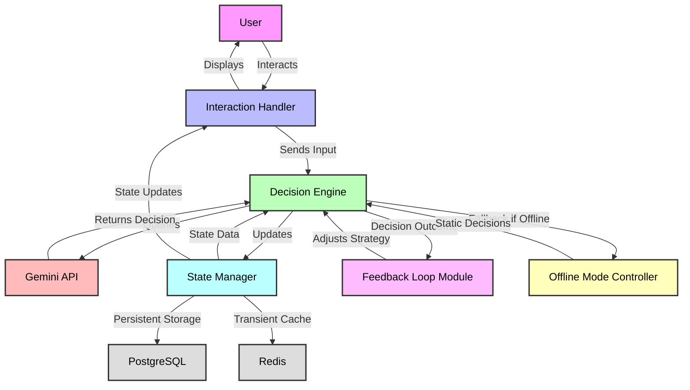
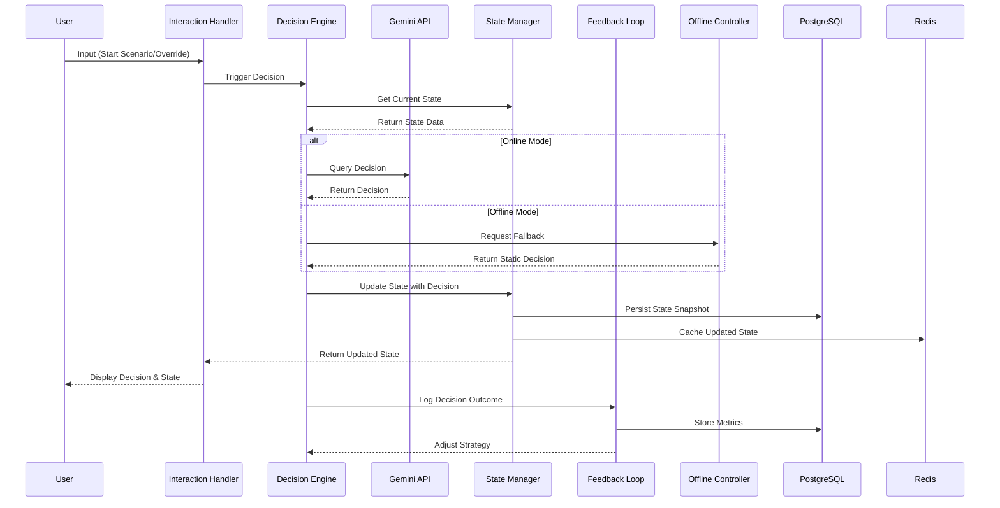

# Phase 1: Technical Specification for Agentic AI Demonstration Framework

## Overview
This document summarizes the work conducted on Day 13 of Phase 1 for the Agentic AI Demonstration Framework within "Restaurant Revenue Rocket." It provides a comprehensive technical specification for the framework, outlining the architecture, integration points with existing systems, data flow between components, required APIs, performance requirements, security considerations, and offline mode constraints. This specification builds on prior Phase 1 deliverables to guide the development of autonomous AI behaviors for restaurant management simulations.

## Objectives
- Define the complete architecture of the Agentic AI Framework, consolidating designs from prior tasks.
- Specify integration points with the existing "Restaurant Revenue Rocket" tech stack (React, Node.js, PostgreSQL, Redis, Docker).
- Detail data flow between components to ensure seamless operation during real-time demos.
- Identify required APIs, particularly the Google Gemini API, for AI decision-making logic.
- Address performance, security, and offline mode requirements to ensure reliability and user trust.

## Architecture Overview
The Agentic AI Framework is designed as a modular, scalable system to enable autonomous decision-making within restaurant management scenarios. It extends the existing "Restaurant Revenue Rocket" application by introducing AI-driven simulations that adapt to user inputs and demonstrate operational impacts. The architecture, detailed in 'docs/phase1-ai-agent-architecture.md', consists of five core components:

1. **Decision Engine**: Generates AI decisions (e.g., inventory ordering, pricing) by processing state data and querying the Gemini API.
2. **State Manager**: Tracks and updates scenario states (e.g., inventory levels, revenue) over time, ensuring consistency.
3. **Interaction Handler**: Manages real-time user interactions, displaying decisions and capturing feedback or overrides via the frontend.
4. **Feedback Loop Module**: Evaluates decision outcomes and adjusts AI strategies for continuous improvement.
5. **Offline Mode Controller**: Provides fallback decision paths for demos without internet or API access.

These components interact through defined data flows, leveraging the existing tech stack for frontend rendering (React), backend logic (Node.js/Express), persistent storage (PostgreSQL), and caching (Redis), all managed within a Dockerized local environment.

### High-Level Architecture Diagram

## Integration Points with Existing Systems
The framework integrates with the current "Restaurant Revenue Rocket" application at multiple levels to ensure compatibility and leverage existing functionality:

1. **Frontend Integration (React, TypeScript)**:
   - **Component Updates**: Extend existing scenario rendering components to include AI decision visualizations (e.g., decision cards, impact graphs) via the Interaction Handler.
   - **State Management**: Use Redux or Context API to manage AI-driven state updates alongside user-driven changes, ensuring UI consistency.
   - **API Calls**: Implement new API endpoints in the frontend to fetch AI decisions and simulation states from the backend.

2. **Backend Integration (Node.js, Express)**:
   - **API Endpoints**: Add Express routes for triggering AI decisions (`/api/ai/decide`), retrieving simulation states (`/api/scenario/state`), and logging user interactions (`/api/user/interact`).
   - **Existing Modules**: Hook into current data processing modules (e.g., ROI calculator) to incorporate AI decision impacts into financial metrics.
   - **Configuration**: Extend environment variables in `.env` files to include Gemini API keys and AI-specific settings (e.g., decision frequency).

3. **Database Integration (PostgreSQL, Redis)**:
   - **Schema Additions**: Implement new tables for scenarios, states, decisions, and interactions as defined in 'docs/phase1-data-structures.md', ensuring foreign key links to existing user or profile data if applicable.
   - **Caching**: Use Redis for active scenario state caching, integrating with existing caching mechanisms for session data to reduce database load.

4. **Deployment Integration (Docker)**:
   - **Container Updates**: Update `docker-compose.local.yml` to include any additional services or volumes needed for AI data storage or API dependencies.
   - **Scripts**: Modify `start-demo.bat` and `stop-demo.bat` to initialize or clean up AI-specific data stores (e.g., Redis cache flush on stop).

## Data Flow Between Components
The data flow ensures seamless operation from user input to AI decision-making to state updates and feedback, supporting real-time demo interactions:

1. **User Input to Decision Trigger**:
   - User interacts with the frontend (e.g., starts a scenario, overrides a decision) via the Interaction Handler.
   - Input is sent to the backend through an Express API endpoint (e.g., `POST /api/scenario/start` or `POST /api/ai/override`).
   - The Decision Engine receives the input, retrieves current state data from the State Manager, and formulates a prompt for the Gemini API if a decision is needed.

2. **AI Decision Generation**:
   - Decision Engine queries the Gemini API with a structured prompt (e.g., including sales data, current inventory).
   - API response is parsed, validated (e.g., ensuring order quantities are positive), and finalized as a decision.
   - Decision details and rationale are logged to PostgreSQL via the State Manager and cached in Redis for quick UI updates.

3. **State Update and Display**:
   - State Manager updates scenario state based on the decision (e.g., reduces inventory after an order) and persists the new state snapshot to PostgreSQL.
   - Updated state is cached in Redis (`scenario:state:<id>`) for low-latency access.
   - Interaction Handler retrieves the updated state via an API call (e.g., `GET /api/scenario/state`) and renders changes in the React frontend (e.g., updated revenue graph).

4. **Feedback and Adjustment**:
   - Post-decision, the Feedback Loop Module evaluates outcomes (e.g., revenue impact) by comparing pre- and post-decision states from PostgreSQL.
   - Adjustments to decision strategies (e.g., tweaking prompt weights) are fed back to the Decision Engine for future decisions.
   - Outcome metrics are logged for historical analysis and demo reporting.

5. **Offline Mode Fallback**:
   - If API access fails (detected by connectivity checks or timeouts), the Decision Engine switches to the Offline Mode Controller.
   - Pre-defined decision paths from local JSON files are used, updating the State Manager as in online mode, ensuring demo continuity.

### Data Flow Diagram

## Required APIs
The framework relies on specific APIs for functionality, with the primary external dependency being the Google Gemini API for AI decision-making:

1. **Google Gemini API**:
   - **Endpoint**: `https://api.google.com/gemini/v2.0/flash` (or as configured in project settings).
   - **Purpose**: Generates decision recommendations based on structured prompts for restaurant management tasks (e.g., inventory, pricing).
   - **Authentication**: Requires API key stored in environment variable (e.g., `GEMINI_API_KEY` in `.env`).
   - **Parameters**:
     - `maxTokens`: Set to 2048 for detailed responses.
     - `temperature`: Set to 0.7 for balanced creativity and accuracy in decision logic.
   - **Input Format**: JSON payload with prompt text, context data (e.g., sales trends), and output format expectations.
   - **Output Format**: JSON response with decision text and rationale, parsed by the Decision Engine.
   - **Error Handling**: Implement retry with exponential backoff for rate limits or timeouts; fallback to Offline Mode Controller on persistent failure.
   - **Usage Limits**: Monitor quota usage to avoid exceeding API limits during high-frequency demo sessions, caching frequent prompts in Redis.

2. **Internal Express API Endpoints**:
   - **`/api/ai/decide` (POST)**: Triggers an AI decision for a given scenario, accepting state context and decision type; returns decision details.
   - **`/api/scenario/state` (GET)**: Retrieves current state for a scenario, pulling from Redis cache if available, else PostgreSQL.
   - **`/api/scenario/start` (POST)**: Initializes a new scenario simulation, creating initial state records.
   - **`/api/user/interact` (POST)**: Logs user interactions (e.g., overrides, feedback) and updates state if needed.
   - **Authentication**: Local session-based auth if user tracking is enabled, otherwise open for demo simplicity.
   - **Rate Limiting**: Implement basic rate limiting on decision endpoints to prevent abuse during concurrent sessions.

## Performance Requirements
To ensure a responsive demo experience, the framework must meet specific performance benchmarks:
- **Decision Latency**: AI decision generation (including API call) should complete within 2 seconds for 90% of requests under normal load (1-5 concurrent sessions). Cache hits in Redis should reduce this to <100ms.
- **State Update Latency**: State updates to Redis and PostgreSQL should complete within 500ms to maintain real-time UI responsiveness.
- **Concurrent Sessions**: Support at least 10 concurrent demo sessions without degradation (response time increase <20%), achieved through Redis caching and PostgreSQL query optimization.
- **Database Queries**: Complex historical queries (e.g., scenario export) should complete within 5 seconds for datasets up to 10,000 records, using indexing and partitioning if needed.
- **Monitoring**: Implement performance logging via `npm run monitor:performance` (if available) to track API response times, database query durations, and cache hit ratios for optimization.

## Security Considerations
Given the local-only deployment model outlined in project documentation, security focuses on data protection and demo integrity:
- **Data Privacy**: No user or client data is transmitted externally except to the Gemini API for decision prompts. Prompt data is anonymized (no personal identifiers) to comply with privacy principles.
- **API Key Protection**: Store Gemini API keys in environment variables (`.env`), inaccessible to frontend code, and restrict access in Docker configurations.
- **Local Storage**: All decision logs, states, and interactions are stored locally in PostgreSQL/Redis, adhering to the project's local-only data policy.
- **Input Validation**: Sanitize all user inputs and API responses to prevent injection attacks or data corruption, especially for JSONB fields in PostgreSQL.
- **Session Isolation**: Ensure scenario data for concurrent demos is isolated (e.g., unique `scenario_id` keys in Redis) to prevent cross-session interference.

## Offline Mode Constraints
To support demonstrations without internet access, as critical for client-facing scenarios, the framework includes offline capabilities:
- **Decision Fallback**: The Offline Mode Controller uses pre-defined decision paths stored in `./frontend/public/assets/data/agentic-ai-offline/` as JSON files, covering key scenarios (e.g., inventory, pricing) identified in 'docs/phase1-restaurant-decisions-automation.md'.
- **State Continuity**: State updates proceed as in online mode, using local logic to simulate decision impacts without API calls.
- **User Experience**: Frontend detects connectivity loss (via simple ping or API failure) and switches to offline mode transparently, maintaining UI consistency with a notification of offline status.
- **Limitations**: Offline decisions are static and lack the adaptive nature of Gemini API responses, potentially reducing realism. This is mitigated by comprehensive pre-defined datasets mimicking typical AI behavior.
- **Documentation**: Offline mode setup and limitations are detailed for consultants in `/docs/` to explain behavior during client demos.

## Technical Requirements Summary
- **Development Tools**: Node.js 20+, Docker Desktop, existing project dependencies as per `package.json`.
- **Hardware**: Minimum 8GB RAM, 4-core CPU on development/demo machines to handle concurrent sessions and database operations, as per README.md.
- **Dependencies**: Gemini API client library (if not already in project), PostgreSQL client, Redis client, all managed via npm.
- **Compatibility**: Ensure Windows local deployment via Docker works seamlessly with scripts like `start-demo.bat`, integrating AI features without additional setup.

## Conclusion
This technical specification for the Agentic AI Demonstration Framework in "Restaurant Revenue Rocket" consolidates the architecture, integration points, data flow, and API requirements to enable autonomous AI-driven restaurant management simulations. It addresses performance, security, and offline constraints to ensure reliability and user engagement in demo environments. Built on prior Phase 1 deliverables, this specification provides a clear blueprint for development in subsequent phases, aligning with the project's mission to showcase AI integration opportunities for restaurant businesses.

**Progress Note**: This completes the Day 13 task of drafting a technical specification document for the Agentic AI Framework. The specification outlines architecture, integration, data flow, and required APIs, with considerations for performance, security, and offline functionality.

**Next Task**: Proceed to Day 14 task of reviewing and finalizing the list of target decisions and scenarios for AI automation, ensuring alignment with project goals and user needs.
