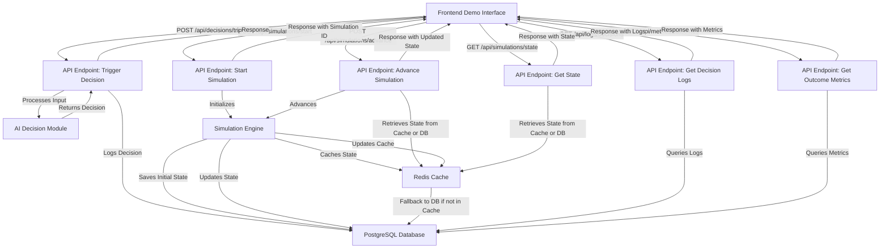

# Phase 2: Backend API Endpoints Documentation

## Overview
This document summarizes the work conducted on Week 6, Day 3-4 of Phase 2 for the Agentic AI Demonstration Framework within "Restaurant Revenue Rocket." The focus is on providing detailed documentation for the backend API endpoints implemented in 'backend/src/api-endpoints.js'. These endpoints facilitate triggering AI decisions, running simulations, and retrieving decision logs or simulation results, ensuring seamless integration with the frontend for real-time demo interactions.

## Objectives
- Document each API endpoint with clear descriptions, usage examples, input/output formats, and error codes.
- Ensure the documentation is accessible and useful for future integration tasks with the demonstration platform.
- Enhance transparency and usability for developers and consultants interacting with the agentic AI framework.

## API Endpoints Overview
The backend API is built using Express.js and is accessible under the base path `/api`. The endpoints are designed to be secure, performant, and aligned with RESTful principles. They interact with the AI decision-making module, simulation engine, Redis caching, and PostgreSQL database (via placeholder functions for now).

### Base URL
All endpoints are prefixed with `/api`. For example, a request to trigger an AI decision would be made to `/api/decisions/trigger`.

### Authentication and User Tracking
- User identification is provided via the `x-user-id` header or `userId` query parameter. If not provided, the system defaults to 'anonymous'.
- Currently, no authentication is enforced (placeholder for future security implementation).

## Endpoint Details

### 1. POST /api/decisions/trigger
#### Description
Triggers an AI decision for a specific decision type and scenario. This endpoint processes input data through the AI decision-making module and returns the decision result.

#### Purpose
Allows the frontend or demo scripts to request AI-driven decisions for restaurant management scenarios such as inventory ordering, dynamic pricing, or staffing optimization.

#### Input Format (Request Body)
- **Content-Type**: `application/json`
- **Parameters**:
  - `decisionType` (string, required): The type of decision to trigger. Must be one of: `inventory-management`, `dynamic-pricing`, `staffing-optimization`.
  - `scenarioId` (string, optional): The identifier of the scenario configuration to use. Defaults to 'fine-dining-001' if not provided.
  - `inputData` (object, optional): Additional input data for the AI decision, such as current inventory levels or sales trends. Structure depends on the decision type.

#### Example Request
```json
POST /api/decisions/trigger HTTP/1.1
Host: localhost:3000
Content-Type: application/json
x-user-id: user123

{
  "decisionType": "inventory-management",
  "scenarioId": "fine-dining-001",
  "inputData": {
    "currentInventory": {
      "Steak": { "quantity": 2, "unit": "kg" },
      "Wine": { "quantity": 10, "unit": "bottles" }
    },
    "predictedDemand": {
      "Steak": { "quantity": 5, "unit": "kg" },
      "Wine": { "quantity": 20, "unit": "bottles" }
    },
    "daysUntilNextDelivery": 2
  }
}
```

#### Output Format (Response Body)
- **Status Code**: 200 (Success), 400 (Bad Request), 500 (Internal Server Error)
- **Content-Type**: `application/json`
- **Parameters**:
  - `status` (string): Indicates the result status ('success' or 'error').
  - `decisionType` (string): Echoes the requested decision type.
  - `decision` (object): The AI-generated decision data, structure depends on the decision type.
  - `rationale` (string): Explanation of why the decision was made.
  - `metrics` (object): Performance or impact metrics related to the decision (if available).
  - `scenarioId` (string): The scenario ID used for the decision.
  - `timestamp` (string): ISO timestamp of when the decision was made.
  - `error` (string, if error): Error message if the request failed.
  - `details` (string, if error): Additional error details if applicable.

#### Example Response (Success)
```json
HTTP/1.1 200 OK
Content-Type: application/json

{
  "status": "success",
  "decisionType": "inventory-management",
  "decision": {
    "order": {
      "Steak": { "quantity": 3, "unit": "kg" },
      "Wine": { "quantity": 10, "unit": "bottles" }
    },
    "expectedDeliveryDate": "2025-06-13"
  },
  "rationale": "Ordered additional inventory to meet predicted demand for the next 2 days, considering low current stock levels.",
  "metrics": {
    "expectedWasteReduction": 0.1,
    "costOfOrder": 450.00
  },
  "scenarioId": "fine-dining-001",
  "timestamp": "2025-06-11T15:30:45.123Z"
}
```

#### Example Response (Error)
```json
HTTP/1.1 400 Bad Request
Content-Type: application/json

{
  "error": "Invalid decisionType. Must be one of: inventory-management, dynamic-pricing, staffing-optimization"
}
```

#### Error Codes
- **400 Bad Request**: Missing required parameters or invalid `decisionType`.
- **500 Internal Server Error**: Unexpected server-side issues, such as AI module failures or connectivity problems.

---

### 2. POST /api/simulations/start
#### Description
Starts a new simulation run with an initial state based on a specified scenario configuration. This endpoint initializes a simulation engine instance for tracking restaurant operations over time.

#### Purpose
Enables the frontend to begin a new simulation session for a user, setting up the initial conditions based on a restaurant type (e.g., fine dining or quick service).

#### Input Format (Request Body)
- **Content-Type**: `application/json`
- **Parameters**:
  - `scenarioId` (string, optional): The identifier of the scenario configuration to initialize the simulation. Defaults to 'fine-dining-001' if not provided.
  - `totalDays` (number, optional): The total number of days the simulation is intended to run. Defaults to 7 if not provided.

#### Example Request
```json
POST /api/simulations/start HTTP/1.1
Host: localhost:3000
Content-Type: application/json
x-user-id: user123

{
  "scenarioId": "quick-service-001",
  "totalDays": 14
}
```

#### Output Format (Response Body)
- **Status Code**: 201 (Created), 404 (Not Found), 500 (Internal Server Error)
- **Content-Type**: `application/json`
- **Parameters**:
  - `status` (string): Indicates the result status ('success' or 'error').
  - `simulationId` (string): A unique identifier for the newly created simulation.
  - `scenarioId` (string): The scenario ID used to initialize the simulation.
  - `initialState` (object): The initial state of the simulation, including inventory, staff, pricing, etc.
  - `message` (string): A confirmation message.
  - `error` (string, if error): Error message if the request failed.
  - `details` (string, if error): Additional error details if applicable.

#### Example Response (Success)
```json
HTTP/1.1 201 Created
Content-Type: application/json

{
  "status": "success",
  "simulationId": "sim-1623456789123-456",
  "scenarioId": "quick-service-001",
  "initialState": {
    "inventory": {
      "Burger Patties": { "quantity": 20, "unit": "kg" },
      "Fries": { "quantity": 15, "unit": "kg" }
    },
    "staff": 4,
    "menu_prices": {
      "Burger Combo": 8.99,
      "Fries": 2.99
    },
    "customer_satisfaction": 0.75,
    "totalDays": 14,
    "day": 1
  },
  "message": "Simulation started successfully"
}
```

#### Example Response (Error)
```json
HTTP/1.1 404 Not Found
Content-Type: application/json

{
  "error": "Scenario configuration not found for the provided scenarioId"
}
```

#### Error Codes
- **404 Not Found**: Scenario configuration not found for the provided `scenarioId`.
- **500 Internal Server Error**: Unexpected server-side issues, such as database or caching failures.

---

### 3. POST /api/simulations/advance
#### Description
Advances a simulation by one day, optionally applying AI decisions to influence the state. This endpoint updates the simulation state based on operational rules and decision inputs.

#### Purpose
Allows the frontend to progress a simulation day-by-day, simulating the impact of AI decisions or default operational changes on restaurant metrics like revenue and customer satisfaction.

#### Input Format (Request Body)
- **Content-Type**: `application/json`
- **Parameters**:
  - `simulationId` (string, required): The unique identifier of the simulation to advance.
  - `aiDecisions` (object, optional): AI-generated decisions to apply for this day, structured by decision type (e.g., inventory orders, price changes).

#### Example Request
```json
POST /api/simulations/advance HTTP/1.1
Host: localhost:3000
Content-Type: application/json
x-user-id: user123

{
  "simulationId": "sim-1623456789123-456",
  "aiDecisions": {
    "inventory-management": {
      "order": {
        "Burger Patties": { "quantity": 5, "unit": "kg" }
      }
    },
    "dynamic-pricing": {
      "priceAdjustments": {
        "Burger Combo": 9.49
      }
    }
  }
}
```

#### Output Format (Response Body)
- **Status Code**: 200 (Success), 400 (Bad Request), 404 (Not Found), 500 (Internal Server Error)
- **Content-Type**: `application/json`
- **Parameters**:
  - `status` (string): Indicates the result status ('success' or 'error').
  - `simulationId` (string): The unique identifier of the simulation.
  - `day` (number): The current day of the simulation after advancing.
  - `state` (object): The updated state of the simulation, including inventory, staff, pricing, revenue, etc.
  - `message` (string): A confirmation message.
  - `error` (string, if error): Error message if the request failed.
  - `details` (string, if error): Additional error details if applicable.

#### Example Response (Success)
```json
HTTP/1.1 200 OK
Content-Type: application/json

{
  "status": "success",
  "simulationId": "sim-1623456789123-456",
  "day": 2,
  "state": {
    "inventory": {
      "Burger Patties": { "quantity": 22, "unit": "kg" },
      "Fries": { "quantity": 12, "unit": "kg" }
    },
    "staff": 4,
    "menu_prices": {
      "Burger Combo": 9.49,
      "Fries": 2.99
    },
    "customer_satisfaction": 0.73,
    "revenue": 450.25,
    "dailySales": [ { "item": "Burger Combo", "quantity": 40, "price": 9.49 } ],
    "totalDays": 14,
    "day": 2
  },
  "message": "Simulation advanced successfully"
}
```

#### Example Response (Error)
```json
HTTP/1.1 404 Not Found
Content-Type: application/json

{
  "error": "Simulation not found or no state available"
}
```

#### Error Codes
- **400 Bad Request**: Missing required parameter `simulationId`.
- **404 Not Found**: Simulation not found or no state data available for the provided `simulationId`.
- **500 Internal Server Error**: Unexpected server-side issues during simulation advancement.

---

### 4. GET /api/simulations/state
#### Description
Retrieves the current or historical state of a simulation for a specific day or the latest available state.

#### Purpose
Enables the frontend to display the current status of a simulation or review past states for analysis during a demo.

#### Input Format (Query Parameters)
- **Parameters**:
  - `simulationId` (string, required): The unique identifier of the simulation to retrieve.
  - `day` (number, optional): The specific day of the simulation to retrieve. If omitted, returns the latest state.

#### Example Request
```http
GET /api/simulations/state?simulationId=sim-1623456789123-456&day=2 HTTP/1.1
Host: localhost:3000
x-user-id: user123
```

#### Output Format (Response Body)
- **Status Code**: 200 (Success), 400 (Bad Request), 404 (Not Found), 500 (Internal Server Error)
- **Content-Type**: `application/json`
- **Parameters**:
  - `status` (string): Indicates the result status ('success' or 'error').
  - `simulationId` (string): The unique identifier of the simulation.
  - `day` (number or string): The day of the retrieved state, or 'latest' if no specific day was requested.
  - `state` (object): The simulation state data for the requested day.
  - `error` (string, if error): Error message if the request failed.
  - `details` (string, if error): Additional error details if applicable.

#### Example Response (Success)
```json
HTTP/1.1 200 OK
Content-Type: application/json

{
  "status": "success",
  "simulationId": "sim-1623456789123-456",
  "day": 2,
  "state": {
    "inventory": {
      "Burger Patties": { "quantity": 22, "unit": "kg" },
      "Fries": { "quantity": 12, "unit": "kg" }
    },
    "staff": 4,
    "menu_prices": {
      "Burger Combo": 9.49,
      "Fries": 2.99
    },
    "customer_satisfaction": 0.73,
    "revenue": 450.25,
    "dailySales": [ { "item": "Burger Combo", "quantity": 40, "price": 9.49 } ],
    "totalDays": 14,
    "day": 2
  }
}
```

#### Example Response (Error)
```json
HTTP/1.1 404 Not Found
Content-Type: application/json

{
  "error": "Simulation state not found for simulationId sim-1623456789123-456, day 2"
}
```

#### Error Codes
- **400 Bad Request**: Missing required parameter `simulationId`.
- **404 Not Found**: Simulation state not found for the provided `simulationId` and `day` (if specified).
- **500 Internal Server Error**: Unexpected server-side issues during state retrieval.

---

### 5. GET /api/logs/decisions
#### Description
Retrieves decision logs for a specific scenario or user, allowing review of past AI decisions made during simulations or standalone requests.

#### Purpose
Supports demo analysis by providing a history of AI decisions, which can be used to explain outcomes or demonstrate AI behavior over time.

#### Input Format (Query Parameters)
- **Parameters**:
  - `scenarioId` (string, optional): Filter logs by a specific scenario ID. If omitted, returns logs for all scenarios.
  - `limit` (number, optional): Maximum number of log entries to return. Defaults to 50.

#### Example Request
```http
GET /api/logs/decisions?scenarioId=quick-service-001&limit=10 HTTP/1.1
Host: localhost:3000
x-user-id: user123
```

#### Output Format (Response Body)
- **Status Code**: 200 (Success), 500 (Internal Server Error)
- **Content-Type**: `application/json`
- **Parameters**:
  - `status` (string): Indicates the result status ('success' or 'error').
  - `count` (number): The number of log entries returned.
  - `logs` (array): List of decision log entries, each containing decision details (currently placeholder data).
  - `filters` (object): The filters applied to the query (scenarioId, userId, limit).
  - `error` (string, if error): Error message if the request failed.
  - `details` (string, if error): Additional error details if applicable.

#### Example Response (Success)
```json
HTTP/1.1 200 OK
Content-Type: application/json

{
  "status": "success",
  "count": 0,
  "logs": [],
  "filters": {
    "scenarioId": "quick-service-001",
    "userId": "user123",
    "limit": 10
  }
}
```

#### Error Codes
- **500 Internal Server Error**: Unexpected server-side issues during log retrieval.

---

### 6. GET /api/metrics/outcomes
#### Description
Retrieves outcome metrics for a specific simulation or metric type, such as revenue or customer satisfaction trends over time.

#### Purpose
Enables the frontend to display key performance indicators (KPIs) and outcomes of AI decisions during simulations for user analysis and learning.

#### Input Format (Query Parameters)
- **Parameters**:
  - `simulationId` (string, optional): Filter metrics by a specific simulation ID. If omitted, returns metrics for all simulations.
  - `metricType` (string, optional): Filter by a specific metric type (e.g., 'revenue', 'customer-satisfaction'). If omitted, returns all metric types.

#### Example Request
```http
GET /api/metrics/outcomes?simulationId=sim-1623456789123-456&metricType=revenue HTTP/1.1
Host: localhost:3000
x-user-id: user123
```

#### Output Format (Response Body)
- **Status Code**: 200 (Success), 500 (Internal Server Error)
- **Content-Type**: `application/json`
- **Parameters**:
  - `status` (string): Indicates the result status ('success' or 'error').
  - `count` (number): The number of metric entries returned.
  - `metrics` (array): List of metric entries, each containing metric details (currently placeholder data).
  - `filters` (object): The filters applied to the query (simulationId, metricType, userId).
  - `error` (string, if error): Error message if the request failed.
  - `details` (string, if error): Additional error details if applicable.

#### Example Response (Success)
```json
HTTP/1.1 200 OK
Content-Type: application/json

{
  "status": "success",
  "count": 0,
  "metrics": [],
  "filters": {
    "simulationId": "sim-1623456789123-456",
    "metricType": "revenue",
    "userId": "user123"
  }
}
```

#### Error Codes
- **500 Internal Server Error**: Unexpected server-side issues during metric retrieval.

---

## Data Flow Diagram
Below is a simplified data flow for how the API endpoints interact with other components of the agentic AI framework:



## Usage Instructions for Consultants
- **Triggering AI Decisions**: Use the `/api/decisions/trigger` endpoint during demos to show real-time AI decision-making. Provide relevant input data (e.g., current inventory) to simulate realistic scenarios for clients.
- **Running Simulations**: Start a simulation with `/api/simulations/start` for a chosen restaurant type (scenario), then use `/api/simulations/advance` to progress through days, optionally applying AI decisions to demonstrate their impact.
- **Reviewing Results**: Use `/api/simulations/state` to show current or past simulation states, `/api/logs/decisions` to review decision history, and `/api/metrics/outcomes` to highlight key metrics like revenue growth or customer satisfaction improvements.
- **Customization**: If a specific restaurant type or decision scenario is needed, request a developer to add a new `scenarioId` with tailored configurations to the system.

## Limitations and Future Enhancements
- **Database Integration**: Current implementation uses placeholder database functions. Future updates will integrate with PostgreSQL for persistent storage of decisions, states, and metrics.
- **Security**: Authentication and authorization are not yet implemented. Future versions will include API key or token-based access control to secure endpoints.
- **Rate Limiting**: To prevent abuse during demos, rate limiting will be added to endpoints like `/api/decisions/trigger` in production environments.
- **Advanced Metrics**: Additional outcome metrics and analytics endpoints will be developed to provide deeper insights into AI performance during simulations.

## Conclusion
This documentation covers the backend API endpoints implemented for the agentic AI framework in "Restaurant Revenue Rocket." These endpoints enable triggering AI decisions, managing simulations, and retrieving relevant data for demo interactions. The detailed usage examples and input/output formats ensure that developers and consultants can effectively integrate and utilize these APIs in the demonstration platform.

**Progress Note**: This completes the Week 6, Day 3-4 task of documenting API endpoints with usage examples and input/output formats. The documentation provides a comprehensive guide for future integration and demo usage.

**Next Task**: Proceed to Week 6, Day 5-7 task of debugging and refining AI decision models and the simulation engine, addressing edge cases and optimizing performance.
